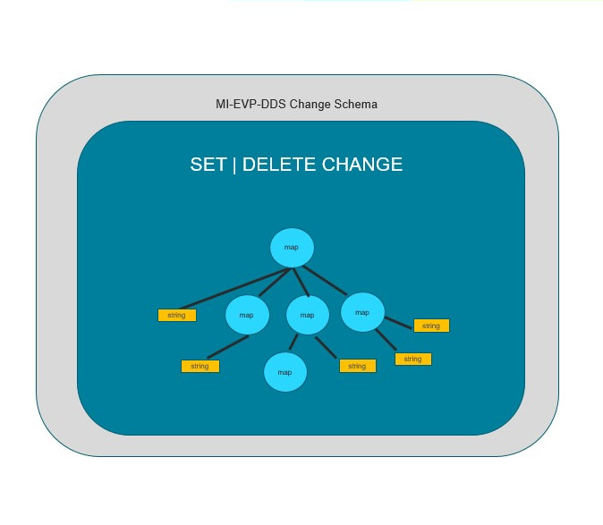
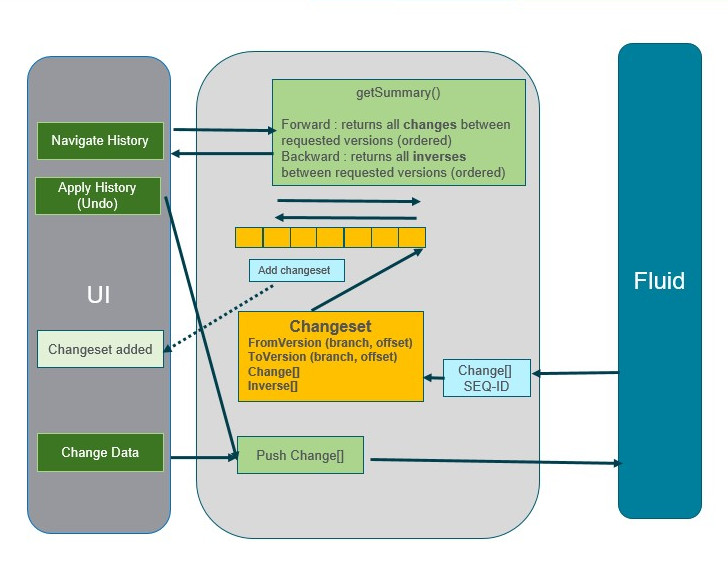
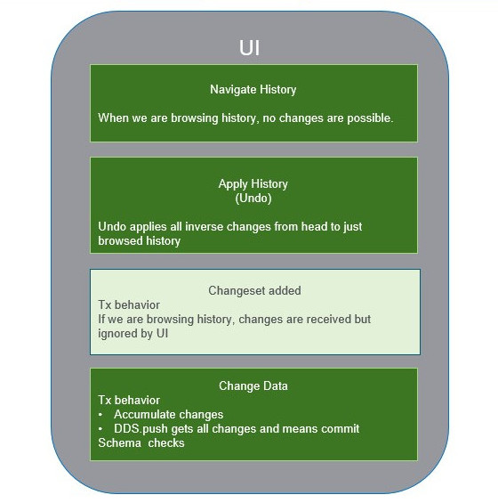
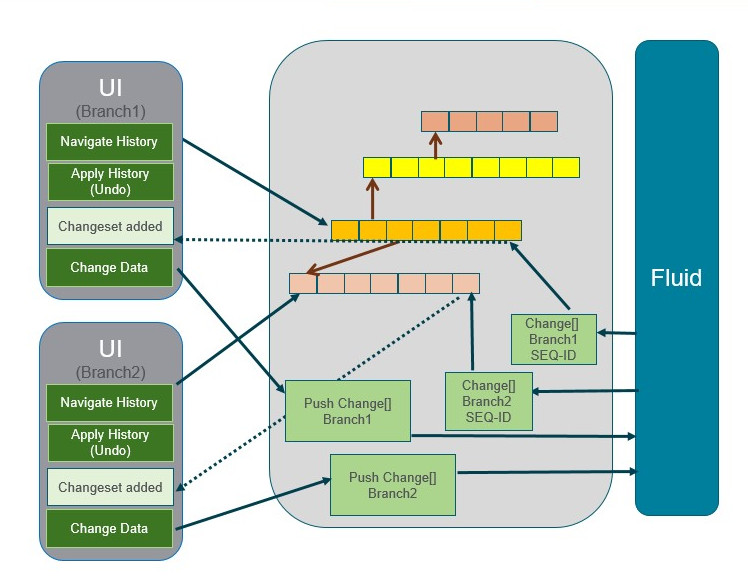
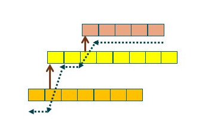
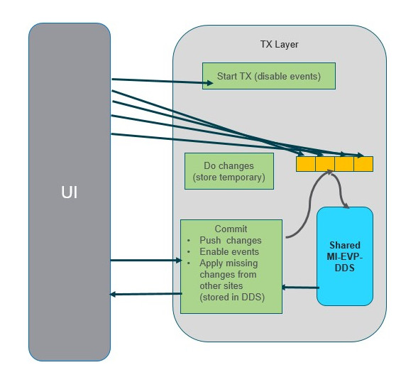
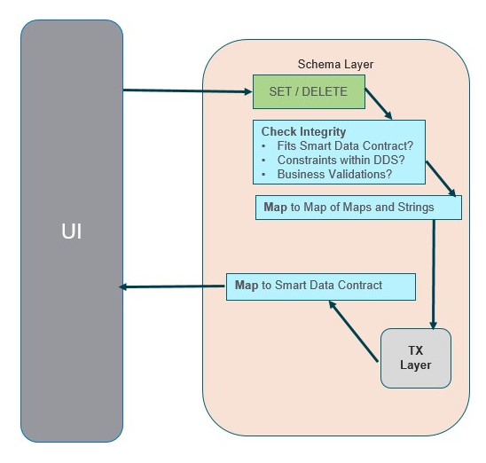
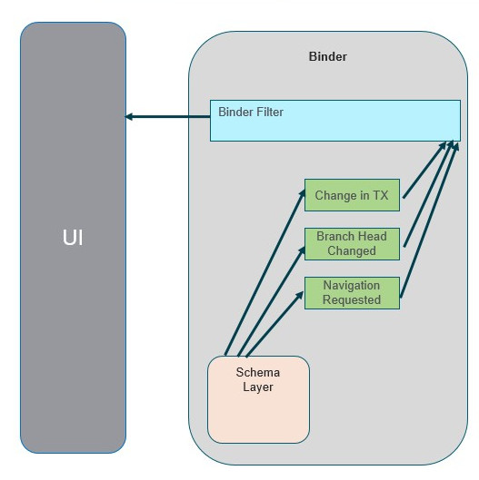

# Experimental Tree DDS (MI-EVP-DDS)

## The Change Schema

Implement a simple change schema (Map of Maps and Strings)
- Changes are expressed with
  - Change Type (SET | DELETE)
  - Change Map of Maps and Strings
- This way we can express any unsorted structure
- Sorted structures can still be implemented in the upper layer
  - Add index column
  - However, the consistency is more complex (Intention Preservation)

## The Basic DDS

The DDS focuses solely on:
- Sending changes
- Receiving sequentialized changes
- Generating Changesets
  - With version position
  - With Inverse changes
- Storing the sequentialized changes

The DDS offers the following API:
- Push changes (one push is atomic and consumes array of changes)
- Get head version position
- Get summarized changeset from any version to any version (forward and backward)

## The UI

The UI contains for now the full schema and TX functionality
- The DDS contains _only very simple functionality_
- The UI checks are responsible for much of the DB functionality
  - Data integrity 
  - Data mapping
  - Atomicity 
    - DDS.push is atomic, UI must accumulate changes expected to be atomic
  - Isolation
  - Event handling

>__Note:__ In a production-ready design most of the functionality included today in the UI layer is subject to be externalized in dedicated layers (operating on top but likely NOT part of the DDS itself)

## Multiple Branches

The DDS should support multiple branches
- The UI can be connected to one branch only
- The UI listen to changes to that branch and get updated

Advanced functionality
- The history navigation through more branches should be possible

## The Transaction Layer

- Various implementations possible
- Postgres like (current transaction does not see changes of transactions started after current transaction is started)
  - On start transaction we disable events from DDS
  - Any change is temporarily stored in the transaction layer
  - On commit those changes are pushed by 1 push
  - The events from DDS are enabled again but not yet processed because we occupy the thread
  - Compare UI latest offset in branch to the latest one in DDS
  - Read and apply the non-applied changes

  

  ## The Schema Layer

- Integrity / business criteria checks on the data modifications
- Mapping between the internal Map of Maps / Strings and business models
  - We are not limited to any type limits in the internal structures, everything is map or string 
  - The mapping layer will map the data to business data structures

  

  ## MI-EVP-DDS Functionality

- __History Browsing__
  - Moving along the branch
  - Events are switched off
- __Undo__ 
  - Pushing the inverse changes up to the required state
  - To avoid the concurrency, the inverse changes should be applied in the form of special change stating reached version
- __Branching__
  - UI can select, on which branch it works, push the changes there and listen to the events solely for that branch
- __Merge / Rebase__
  - In DDS it would only mark merge 
  - _Inverse operation is challenging because we can interpret merge different ways, design needed_ 
- __Partial history checkout__ can be realized by splitting the changes to multiple containers, no need for changes in fluid server
- __Partial property checkout__ would require changes in fluid server
  - We should be able to split our data to containers based on consistency needs and those atomic data should not be huge

## The Binding

- The DDS will post the event containing the applied Changeset
- The branch, versions and changes are accessible
- A configurable Binder can be implemented which will listen to events
  - Checks the branch for action relevance
  - Iterates all properties and compares it to interest
  - Executes the binder code per each relevant property /  set of properties
- Binders should be able to react not only to events from DDS but also to request of extended features like history navigation or changes within the transaction

  